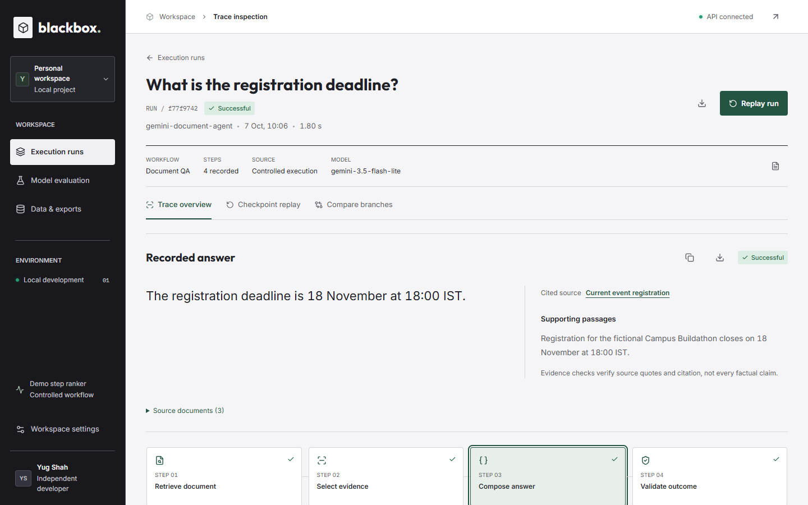

# Black Box

### Inspect AI document answers. Trace failures. Test corrections.

[](https://github.com/Yug-Shah17/BLACKBOX-AI/actions/workflows/check.yml)

**[Open the Live Demo](https://blackbox-ai-delta.vercel.app)** | [Source Code](https://github.com/Yug-Shah17/BLACKBOX-AI)

Public student demo: use fictional or non-sensitive documents only. Run history is shared, not private. The free backend may take about a minute to wake after inactivity, and newly saved runs can be lost when it sleeps, restarts or redeploys. Download important results before leaving.

Black Box is a document-answering and execution-inspection prototype built by **Yug Shah**. It makes a bounded answering pipeline visible: inspect the answer, follow its source evidence, investigate failed checks, and replay a correction without overwriting the original execution.

**The goal is not just to get an answer, but to understand how that answer was produced.**

[Quick Start](#quick-start) | [Demo](#try-the-demo) | [Architecture](#how-it-works) | [Verification](#verification) | [Limitations](#scope-and-limitations)



*An actual application capture showing a recorded document answer and its execution trace.*

## The Problem

A document-answering system can return an answer that looks convincing while selecting an outdated source, attaching the wrong citation, or producing unsupported text. The final response alone does not show where the workflow went wrong.

Black Box explores a practical debugging loop for that problem:

1. Record the answering workflow.
2. Inspect the answer alongside its sources and recorded stages.
3. Identify a likely faulty stage from observable evidence.
4. Supply a correction at a supported checkpoint.
5. Compare the replay with the original.

This is a working, explainable student prototype with controlled workflows, not a universal debugger or an automatic repair engine.

## What You Can Do

| Capability | What it provides |
|---|---|
| **Upload documents** | Preview TXT, Markdown, text-based PDF and DOCX files; edit source topics and current-source flags. |
| **Ask document questions** | Use optional consent-based Gemini answering, or run supported single-word frequency queries locally. |
| **Inspect evidence** | Read the answer beside supporting passages and navigate directly to its cited source. |
| **Explore execution traces** | Inspect recorded step inputs, outputs, timings, statuses and validation results. |
| **Investigate failures** | View evidence-based rule diagnosis for document runs and a learned step-ranking experiment for arithmetic runs. |
| **Replay a correction** | Replace a supported intermediate output, reuse the recorded prefix and execute the remaining stages in a new branch. |
| **Compare branches** | Compare original and replay answers, outcomes, first divergence and step outputs. |
| **Export results** | Download answers, execution reports and structured comparison data. |
| **Try prepared examples** | Use fictional registration, eligibility and submission policies, including deliberately injected failure scenarios. |

The interface includes a homepage, execution history, trace workspace, evaluation and dataset views, light/dark themes, and reduced-motion support.

## How It Works

### Document workflow

```text
Question + document sources
            |
            v
        Retrieval
            |
            v
     Source selection
            |
            v
    Answer generation
     (local or Gemini)
            |
            v
        Validation
            |
            v
Recorded answer + evidence + execution trace
```

Document retrieval uses **topic-word matching**, not embeddings or a vector database. Source selection works within the retrieved candidates. Generation uses the configured local behavior or the optional Gemini integration. Validation applies bounded source, citation and answer checks.

A passed check is useful evidence, but it is **not proof that every answer is factually correct**.

### Checkpoint replay

```text
Original:  Retrieval -> Selection -> Generation -> Validation
                            |
                       Correction
                            |
Replay:    Reused prefix -> Corrected step -> Executed suffix
                            |
                   Separate saved branch
```

Checkpoints are recorded before steps. A replay substitutes one supported step output and executes the suffix again. The original run remains unchanged, and the correction can still fail validation.

### Two distinct diagnosis paths

- **Documents:** evidence-based rules over recorded observations. No learned document-diagnosis model is claimed.
- **Arithmetic:** a five-stage regression/demo workflow with logistic-regression step ranking, synthetic evaluation and a rule baseline.

The arithmetic workflow remains useful for testing the tracing and replay infrastructure. Document answering is the main user-facing demonstration.

## Technology

| Layer | Implementation |
|---|---|
| Frontend | Next.js 16.3.8, React 19.2.8, TypeScript, Tailwind CSS 4, Lucide icons |
| Backend | Python, FastAPI, Pydantic, Uvicorn |
| Optional answering | Backend-only Gemini integration with explicit document-sharing consent |
| Document extraction | pypdf for text PDFs; bounded DOCX XML extraction |
| ML experiment | scikit-learn logistic regression, NumPy and reproducible synthetic traces |
| Persistence | Local file-based run and checkpoint storage with atomic writes |
| Testing | Python backend suites, Node frontend tests and browser workflow checks |

No paid model API is required for the local demonstration. Gemini availability and free-tier quotas depend on the configured provider account.

## Quick Start

### Requirements

- Python **3.14**, matching the locally tested pinned environment.
- A compatible Node.js installation; the frontend tests require **Node 22.18+** with native TypeScript support.
- npm and PowerShell for the Windows setup below.

Run these commands from the repository root:

```powershell
powershell -ExecutionPolicy Bypass -File scripts\setup.ps1
.\.venv\Scripts\python.exe -B scripts\check.py
.\.venv\Scripts\python.exe scripts\start.py
```

Open the [homepage](http://127.0.0.1:3000/) and enter the workspace. Backend API documentation is available at [http://127.0.0.1:8000/docs](http://127.0.0.1:8000/docs).

The setup script preserves an existing virtual environment, installs the root Python requirements, prepares a missing model and installs the frontend lockfile. Use `-SkipFrontend` for Python-only setup or `-RebuildModel` to regenerate the seed-42 training data and model. Never load an untrusted `.joblib` artifact.

Press **Ctrl+C** in the launcher terminal to stop both services. If the default ports are occupied:

```powershell
.\.venv\Scripts\python.exe scripts\start.py --backend-port 8001 --frontend-port 3001
```

The launcher is for local development, not production hosting.

<details>
<summary>Manual setup</summary>

The Windows setup has been exercised locally. Linux/macOS commands are provided as a manual path, not a claim of verified cross-platform execution.

```sh
python3.14 -m venv .venv
source .venv/bin/activate
python -m pip install -r requirements.txt
python -m ml.generate_dataset --scenarios 100 --seed 42
python -m ml.train_model
python scripts/check.py
```

On Windows, activate with `.\.venv\Scripts\Activate.ps1` instead of `source`.

Install the frontend dependencies from its directory:

```sh
cd frontend
npm ci
```

Start the backend from the repository root and the frontend from `frontend`, in separate terminals:

```sh
python -m uvicorn backend.app.main:app --host 127.0.0.1 --port 8000 --workers 1
```

```sh
npm run dev -- --hostname 127.0.0.1 --port 3000
```

</details>

## Try The Demo

### Without an API key

1. Open the homepage and enter the workspace.
2. Create a document run using a fictional example or upload a supported file.
3. For an uploaded file, choose local mode and ask a single-word count question such as **How many times does "registration" appear?**
4. Inspect the answer, cited source and execution stages.
5. Use a prepared failure scenario to inspect diagnosis, replay a supported correction and compare both branches.

For other questions, local mode returns selected source text; it is **not a general-purpose local language model**.

### With Gemini configured

Use Gemini mode for broader document questions and explicitly consent to sending the selected document context to the provider. Inspect the returned answer, quotes and citation in the trace workspace.

Keep `GEMINI_API_KEY` in the **backend environment only**. Never commit it or put it in a `NEXT_PUBLIC_` variable. The local demo still works without it.

For a repeatable local replay demonstration, with the backend running:

```powershell
.\.venv\Scripts\python.exe -B scripts\student_demo.py
```

This checks a failed source-selection run, correct and incorrect replay branches, and preservation of the original. See the [Demo Guide](docs/DEMO.md) and [Student Walkthrough](docs/STUDENT_WALKTHROUGH.md).

## Upload Support

| Format | Limits |
|---|---|
| TXT / MD | UTF-8 text, up to 40,000 bytes per file |
| PDF | Text-based, unencrypted; up to 2,000,000 bytes and 20 pages |
| DOCX | Up to 2,000,000 bytes; body paragraph/table text extraction |

The upload dialog accepts **1-10 files**. Extracted text must contain **1-10,000 characters per document**.

Scanned PDFs, OCR, legacy `.doc` files and exact layout preservation are not supported. Uploaded sources are not combined into a general multi-document synthesis engine. Source topics and current-source flags are user-provided metadata.

Raw PDF/DOCX files are not saved by the extractor, but extracted source text is persisted with executions. Use fictional or non-sensitive documents.

## Verification

The recorded **October 7, 2026** verification passed:

- **26 frontend tests**, frontend lint and the Next.js production build.
- **65 backend tests and 98 subtests**.
- Browser upload checks for TXT, MD, PDF and DOCX.
- Citation navigation, answer editing, corrected and incorrect replays, branch comparison and duplicate-submission protection.
- Persistence checks across a scoped restart, preserving six baseline traces.
- Desktop/smaller-screen layouts, both themes and reduced-motion behavior.
- One fresh consented Gemini answer from a fictional document, with matching recorded quotes.

These are bounded verification results, not a production certification, full accessibility audit or general answer-accuracy score. See [Final Verification](docs/FINAL_VERIFICATION.md) for the detailed record.

Run the project quality gate from the repository root:

```powershell
.\.venv\Scripts\python.exe -B scripts\check.py
```

Run frontend checks from `frontend`:

```sh
npm test
npm run lint
npx tsc --noEmit --incremental false
npm run build
```

## Evaluation And Honest Claims

Reproduce the evaluation from the repository root:

```sh
python -m ml.evaluate_model
python scripts/replay_benchmark.py
python scripts/document_benchmark.py
```

The document benchmark covers **12 controlled failure cases and 3 healthy cases** across fictional scenario packs. It measures rule diagnosis and fixture-supplied corrections, not real-world document-model accuracy.

The arithmetic model and earliest-evidence rules both localize all injected failures in the current synthetic benchmark. **No ML advantage over the rule baseline has been demonstrated.** Ranking scores are uncalibrated signals, not confidence percentages.

Evaluation uses temporary stores rather than saved demonstration history. Dataset generation and training overwrite their own artifacts; evaluation does not retrain the model. See [Evaluation](docs/EVALUATION.md) and the [Model Card](docs/MODEL_CARD.md) for methodology and limitations.

## Repository Guide

```text
backend/app/          API, document execution, replay and persistence
frontend/            Next.js homepage and inspection workspace
ml/                  Trace schema, synthetic data, features and ranking
scripts/             Setup, startup, verification and benchmarks
docs/                Architecture, demo, evaluation and handoff guides
data/                Document benchmark artifacts
```

Root `requirements.txt` is the canonical Python dependency list. Runtime history, virtual environments, caches and secrets are excluded from Git.

## Scope And Limitations

- Supports **configured document and arithmetic workflows**, not arbitrary external agents or uploaded execution traces.
- Corrections are supplied by the user or benchmark fixtures; there is no autonomous repair generation.
- Document retrieval is keyword-based, and source flags are not verified for authenticity or recency.
- Supporting quotes and validation checks do not guarantee factual correctness.
- No authentication or per-user data isolation: history and sources are shared within a backend instance.
- Storage is designed for **one backend worker**; it is not a distributed database.
- Public Gemini usage can consume the configured account quota.
- The frontend needs a Next.js server, and persistent history requires suitable backend storage.

**Current status: deployed public demonstration on Vercel Hobby and Render Free.** The homepage, workspace, backend readiness and document catalog were checked through the public frontend on October 7, 2026. Local end-to-end verification and hosted connectivity checks are distinct: the complete hosted upload, answer and replay flow still needs verification. This is not a private document service. See the [Submission Handoff](docs/SUBMISSION_HANDOFF.md) for hosting and privacy limitations.

## Further Reading

| Document | Purpose |
|---|---|
| [Architecture](docs/ARCHITECTURE.md) | Execution, tracing, checkpoints and persistence |
| [Document Workflow](docs/DOCUMENT_WORKFLOW.md) | Detailed local workflow and upload contracts |
| [Student Walkthrough](docs/STUDENT_WALKTHROUGH.md) | Explain and defend one complete run |
| [Demo Guide](docs/DEMO.md) | Submission demonstration sequence |
| [Evaluation](docs/EVALUATION.md) | Benchmark methodology and limitations |
| [Model Card](docs/MODEL_CARD.md) | Arithmetic ranking model and intended use |
| [Browser Checks](docs/BROWSER_CHECKS.md) | Repeatable local browser smoke checks |
| [Submission Handoff](docs/SUBMISSION_HANDOFF.md) | Ownership, deployment boundaries and next steps |

## Author

**Yug Shah** - independent student project.

[GitHub](https://github.com/Yug-Shah17) | [LinkedIn](https://www.linkedin.com/in/yug-shah-lnkdn/)

The GitHub link is the author's profile, not a project repository link.
