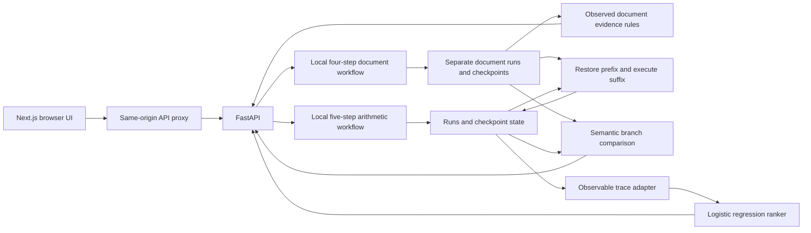

# Architecture

## Data Flow

The UI uses a same-origin backend proxy and combines both run histories. Document
runs also expose source context, fictional scenario selection, and their own
regression evaluation; these do not feed the arithmetic ranker.

## Contracts

Canonical observed traces use `black-box.agent-run.v1`, zero-based `stepIndex`,
unique string step IDs, earlier-step dependencies, structured JSON input/output,
timezone-aware timestamps, finite durations, status, and optional checkpoint IDs.
The supported arithmetic source requires all five steps in order. Validation
rejects malformed arithmetic fields, non-finite JSON values, and nested labels.

The display API retains one-based integer `stepId` and `checkpointStep` for the
frontend. `traceStepId` maps each display step back to the canonical trace ID.
Never mix the two numbering systems.

Document records use `document-qa-v1` and four one-based display steps. Their
recorded `steps` are not the canonical arithmetic model input. The separate source
endpoint returns the original question and documents without injection labels.
Rule diagnosis uses the recorded inputs and outputs, not private fault settings.

Ground truth (`scenarioId`, `failureType`, `rootCauseStepId`) stays in separate
evaluation labels. Private execution/checkpoint configuration records the
injected fault for replay, but the predictor receives only the observed trace.
Client-supplied diagnosis annotations do not override the saved trace.

## Training

100 scenarios x 5 variants = 500 generated runs. A scenario-grouped split keeps
related variants together. The default split has 75 training and 25 test scenario
IDs. Answer-composition faults are excluded from training, leaving 300 training
runs. Features describe step kind, explicit errors, local mismatch, and missing
input. `DictVectorizer` and balanced logistic regression learn per-step scores.
IDs, timings, task outcomes, and evaluation labels are not model features.

## Replay Semantics

Checkpoints contain state immediately **before** a step, private configuration,
workflow version, and the existing trace prefix. Replay clones the prefix,
applies a validated replacement output at the selected step, and executes the
suffix. It also clones prefix checkpoints so branches remain replayable.

Only arithmetic steps 1-4 or document steps 1-3 can be overridden. The final validator always executes; users
cannot replace `{passed: true}` to manufacture success. Later configured faults
still execute. Wrong corrections stay failed. Original runs are never updated.
Changed steps and executed steps are different: executing a step may produce
the same semantic output.

## Persistence and Operations

`backend/data/state.json` stores arithmetic records and checkpoints; documents use
`backend/data/documents/state.json`. An in-process lock
protects read-modify-write; a same-directory temporary file, flush/fsync, and
atomic replacement protect the previous file on a failed write. This is **not**
multi-process coordination. Run exactly one backend worker.

`/health` checks process liveness. `/ready` checks model loading, metrics/version
compatibility, and readable storage. It does not promise disk write permission
or public production readiness. Missing/corrupt artifacts produce explicit errors.
Restart after changing a model: the predictor is cached after first load.

The document evaluation endpoint checks its report schema, workflow version,
case count, and scenario fingerprint. A missing, malformed, or stale report is
unavailable rather than silently presented as a fresh measurement. Storage reads
validate public records; corrupt state returns a service error without overwriting
the original file. Replay additionally validates saved configuration and checkpoint
consistency before persisting a new branch.

Document replay checks the complete original observation sequence and all four
checkpoints, not only the reused prefix. Recorded JSON text must agree with its
structured input/output, and the final outcome must agree with observable source,
answer, citation, and validation evidence. Storage parsing rejects non-finite
numbers, including overflowing numeric literals; public numeric fields reject
non-finite coercions too.

No authentication, distributed queue, database migrations, remote agents, or
container deployment is implemented. Adding those is a separate scope.
